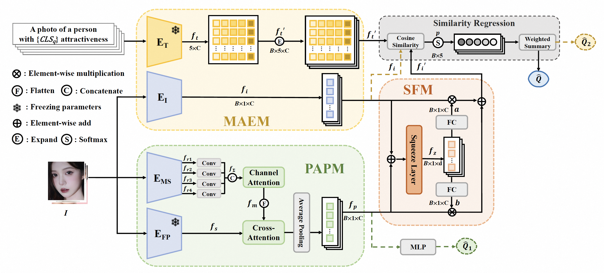

<div align="center">
<h3>FPEM: Face Prior Enhanced Facial Attractiveness Prediction for Live Videos with Face Retouching [ICCV 2025]</h3>
Hui Li, Xiaoyu Ren, Hongjiu Yu, Ying Chen*, Kai Li, L Wang, Xiongkuo Min, Huiyu Duan, Guangtao Zhai, Xu Liu

</div>

## TODO
- [ ] Release the dataset.
- [ ] Release the FPEM model and inference code.

## Dataset Statistics
- **Examples of the face images in our LiveBeauty dataset.**
<p align="center">
    
</p>

## Experimental Results
- **Experimental results of various SOTA methods and our FPEM across three FAP datasets.**
<p align="center">
    
</p>

## Citation
```
If you find this work useful for your research, please consider citing our paper:
@inproceedings{li2025fpem,
  title={FPEM: Face Prior Enhanced Facial Attractiveness Prediction for Live Videos with Face Retouching},
  author={Hui Li, Xiaoyu Ren, Hongjiu Yu, Ying Chen*, Kai Li, L Wang, Xiongkuo Min, Huiyu Duan, Guangtao Zhai, Xu Liu},
  booktitle={Proceedings of the IEEE/CVF International Conference on Computer Vision, ICCV 2025},
  year={2025}
}
```
