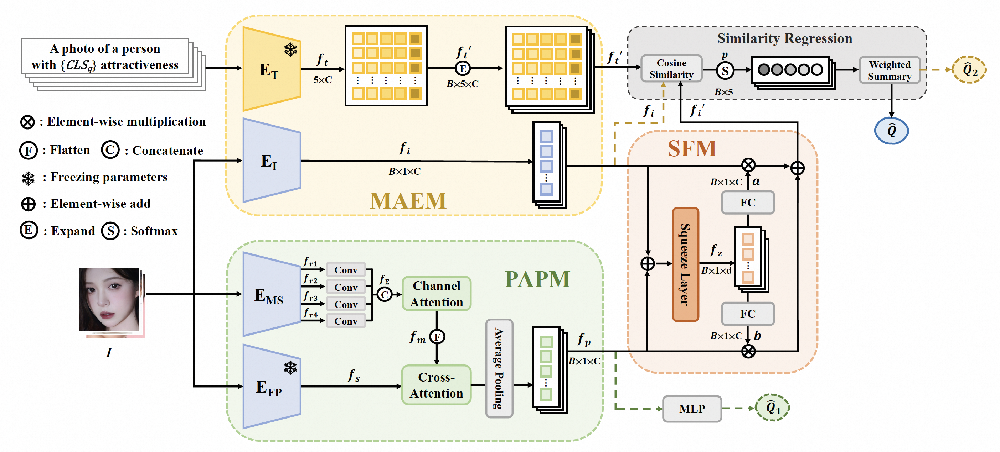
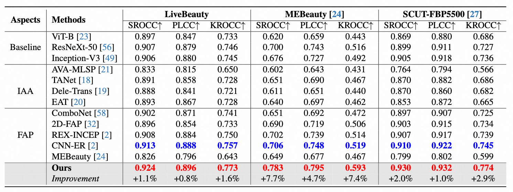

<div align="center">
<h3>FPEM: Face Prior Enhanced Facial Attractiveness Prediction for Live Videos with Face Retouching [ICCV 2025]</h3>
Hui Li, Xiaoyu Ren, Hongjiu Yu, Ying Chen*, Kai Li, L Wang, Xiongkuo Min, Huiyu Duan, Guangtao Zhai, Xu Liu

</div>

## News
* **[2025-11-03]** The FPEM model is released.
* **[2025-11-03]** The paper is released on [ICCV2025](https://openaccess.thecvf.com/content/ICCV2025/html/Li_FPEM_Face_Prior_Enhanced_Facial_Attractiveness_Prediction_for_Live_Videos_ICCV_2025_paper.html)🔥.

## TODO
- [X] Release the FPEM model.
- [X] Release the dataset.

## Dataset Statistics
- **Examples of the face images in our LiveBeauty dataset.**
<p align="center">
    
</p>

We provide two version of LiveBeauty dataset, you can download them from [https://tianchi.aliyun.com/dataset/216302].
One version is the same dataset as the one in the paper denoted as LiveBeauty-essay, the other is a complete-face-version denoted as LiveBeauty-public.
The complete-face-version contains complete face images and the corresponding original frames of the live videos.

To avoid disputes, the celebrity faces are removed fom the dataset.


## Experimental Results
- **Experimental results of various SOTA methods and our FPEM across three FAP datasets.**
<p align="center">
    
</p>

The pretrained checkpoints for FPEM described in the paper are available in the FPEM-release/pretrained folder.

## Installation
```shell
# Create your environment
conda create -n fpem python=3.8
conda activate fpem
pip install --upgrade pip

# Install pytorch with cuda
pip install torch==1.13.1+cu117 torchvision==0.14.1+cu117 torchaudio==0.13.1 --extra-index-url https://download.pytorch.org/whl/cu117

# Install Dependencies
pip install -r requirements.txt
```
There is no need to install all dependencies listed in the requirements.txt, but you should make sure `protobuf==3.19.0`

## Train
```shell
chmod +x train.sh
# run train.sh for <base> experiment, you can creat your own exp name which must have config.yml in it
bash train.sh experiments/base
```
## Test
```shell
chmod +x test.sh
# replace your ckpt.pth path in config.yml-> saver -> resume_model 
bash test.sh experiments/base
```

## Citation
```
If you find this work useful for your research, please consider citing our paper:
@inproceedings{li2025fpem,
  title={FPEM: Face Prior Enhanced Facial Attractiveness Prediction for Live Videos with Face Retouching},
  author={Hui Li, Xiaoyu Ren, Hongjiu Yu, Ying Chen*, Kai Li, L Wang, Xiongkuo Min, Huiyu Duan, Guangtao Zhai, Xu Liu},
  booktitle={Proceedings of the IEEE/CVF International Conference on Computer Vision, ICCV 2025},
  year={2025}
}
```
